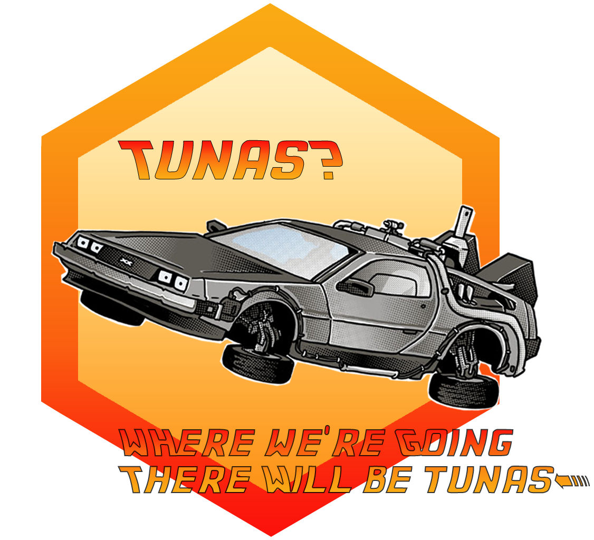

<!-- README.md is generated from README.Rmd. Please edit that file and click on Knit button at the end. -->

# t3 package <a href='https://ob7-ird.github.io/t3'></a>

<!-- badges: start -->

[](https://cran.r-project.org/package=t3)
[](https://www.tidyverse.org/lifecycle/#experimental)
[](https://zenodo.org/badge/latestdoi/210599699)

<!-- badges: end -->

## Warning

Package and documentation still in construction \! We need few more time
to reach 88 miles per hours, be patient.

## Overview

The new version of Tropical Tuna Treatment (T3) process is developed in
R language and available through a package. One of the advantages of
this language is that it is more understandable and manipulated by the
fisheries’ scientific community rather than Java language. Moreover,
this development follows the principles of the open and reproducible
science:

  - Process transparency: the code is fully documented and the
    [documentation](https://ob7-ird.github.io/t3) of how works the
    program will be available.
  - Open access and Open source: the code source is hosted on a github
    repository [t3](https://github.com/OB7-IRD/t3/) under a GPL version
    3 license. In the end, it would be available on the Comprehensive R
    Archive Network (CRAN).
  - Referencing of the software : enable result reproducibility and
    versioning (Depetris et al., 2020) : version 0.9.0 -
    [DOI: 10.5281/zenodo.3878125](https://zenodo.org/badge/latestdoi/210599699).

## Installation

``` r
# devtools package is necessary for t3 package compilation
install.packages("devtools")
# download the last package release stable from GitHub 
devtools::install_github("https://github.com/OB7-IRD/t3",
                         ref = "0.9.1")
```

### Development version

To get a bug fix or to use a feature from the development version, you
can install the development version of t3 from GitHub.

``` r
# install.packages("devtools")
devtools::install_github("https://github.com/OB7-IRD/t3/tree/development")
```

## Cheatsheet

Working in progress for this section.

## Usage

``` r
library(t3)
# Next steps example will be added later
```

## Getting help

If you encounter a clear bug, please file an issue with a minimal
reproducible example on [GitHub issues
page](https://github.com/OB7-IRD/t3/issues). This link is also available
if you have any questions and improvement propositions.

## References

Working in progress for this section.
