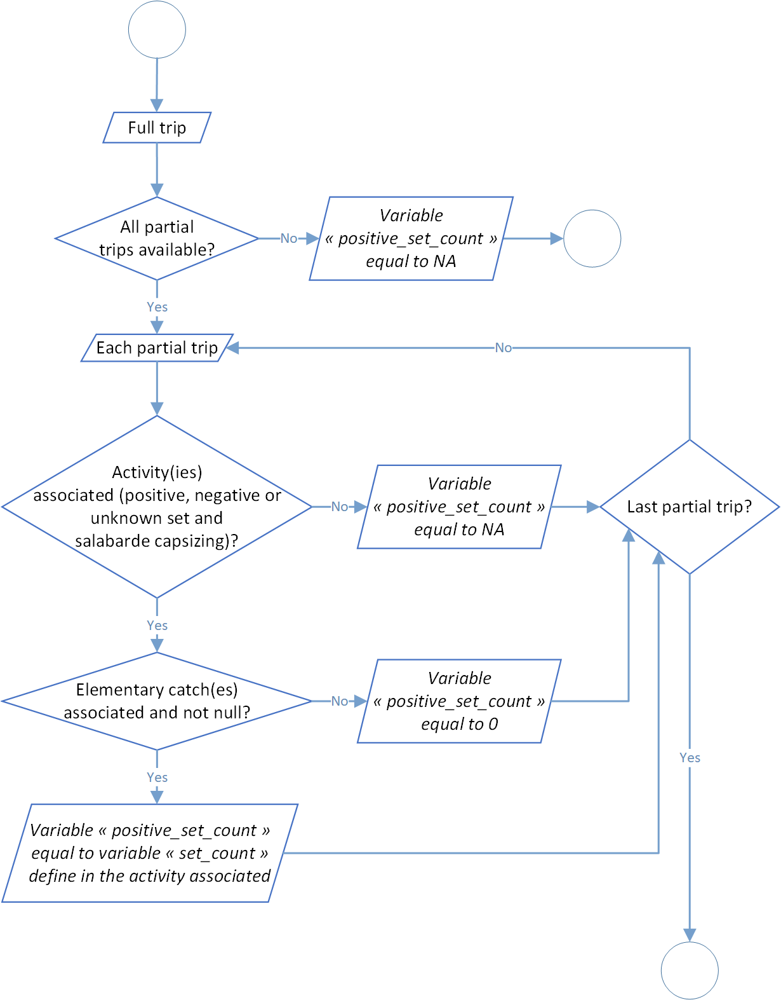

```{r, include = FALSE}
knitr::opts_chunk$set(
  collapse = TRUE,
  comment = "#>"
)
```

<div style="text-align: justify">

## Logbooks standardisation

The first level of the t3 process aim to standardize logbook data. These standardization was divided into 8 steps:

| Process                                           | Code/method associated         | Class(es) associated | Observations |
|---------------------------------------------------|--------------------------------|----------------------|--------------|
| Process 1.1: Raising Factor level 1               | `rf1()`                        | full_trips           |              |
| Process 1.2: Raising Factor level 2               | `rf2()`                        | full_trips           |              |
| Process 1.3: logbook weigth categories conversion | `conversion_weigth_category()` | full_trips           |              |
| Process 1.4: postive sets count                   | `set_count()`                  | full_trips           |              |
| Process 1.5: set duration calculation             | `set_duration()`               | full_trips           | In hours     |
| Process 1.6: time at sea calculation              | `time_at_sea()`                | full_trips           | In hours     |
| Process 1.7: fishing time calculation             | `fishing_time()`               | full_trips           | In hours     |
| Process 1.8: searching time calculation           | `searching_time()`             | full_trips           | In hours     |

### Process 1.1: Raising Factor level 1

Catches filled in logbooks are based on visual estimations when they rise from the purse senner salabarde. This is the only technical way available at this moment to have an estimation by species. Thereafter, catches will be stored in one or several wells. During the landing process, well catches will be weighed, generally through a peson located under the unloading crane. By move from set to well(s) we lost the exact information about catch location.

Regarding this process, for each full trip we will calculate a Raising Factor (RF), ratio of landing weight on catch weight. To recall, one full trip should be composed of one or several partial trip, for example if a vessel unloads a part of these wells and go back to the sea with not empty well(s). Furthermore, a RF level 1 value is normally between 0.8 and 1.2. If any values were out of range, an investigation if necessary for data quality control. This range could be modified through function parameters `rf1_lowest_limit` (by default at 0.8) and `rf1_highest_limit` (by default at 1.2). In addition, you will find in the function log a warning for each RF level 1 value out of range. This ratio will be applied to logbook catches to adjust declared values (by rising or lower them).

Be careful, so far in the process all RF level 1 values will be applied to the logbook catches associated, even if values are out of range. It's up to the user to check the log file and correct data, if necessary, before moving to the next process.

Furthermore, not all the well species are weighted during the landing process. Only several tunas species are purchased (and weighted by association). In addition, these species should be different for each fleet, especially because canneries don't purchased through the same rules according to the fleet. This raising factor will be estimated only on theses species. Species list could be modified through the function parameter `species_rf1`. For now theses following selections were validated since several years:

* for French (French and Mayotte fleets), use codes 1 (*Thunnus albacares*), 2 (*Katsuwonus pelamis*), 3 (*Thunnus obesus*), 4 (*Thunnus alalunga*), 9 (mix of tunas species) and 11 (*Thunnus tonggol*).

* for Spain (Spanish and Seychelles fleets), use codes 1 (*Thunnus albacares*), 2 (*Katsuwonus pelamis*), 3 (*Thunnus obesus*), 4 (*Thunnus alalunga*), 5 (*Euthynnus alletteratus*), 6 (*Auxis thazard*),  9 (mix of tunas species) and 11 (*Thunnus tonggol*).

In addition, if logbook(s) are missing we can't apply the process. In that case, we will tried to apply the process of Raising Factor level 2 (see section below regarding the process `rf2()`).

By the way, there are several cases when the RF level 1 can't be calculated. Take a look to the diagram below to have a brief overview of the process. You could notify that the structure of the process should be strange in terms of informatics efficiency (for example with repetitions of some steps, not necessarily on the first look). This is perfectly normal because we think about the potential improvement of the process in the future and we let the field open for an easier implementation.


<div style="text-align: center">Figure 1: Raising Factor level 1 flowchart</div>

### Process 1.2: Raising Factor level 2

In some cases, especially for historial data, several logbooks trips were not collected or available. Therefore it's impossible to apply the process 1.1. Don't do anything for this trips would result in an under-estimation of catches among the global process. Of course and like the process 1.1, we made the hypostesis that all the landings were know and available.

So far, this process is partially implemented in the source code and in our data simulation since 2000 we haven't been faced with trips with missing logbooks. Due to time constraints, the development of this process has been postponed, but it will be essential to finalise it when we run our process on the whole time serie (and when we manipulated historical data). The figure below show the actual development of the process. 


<div style="text-align: center">Figure 2: Raising Factor level 2 flowchart</div>

### Process 1.3: logbook weigth categories conversion

The core of the t3 process is to consider that the species composition of the logbooks was biased. Furthermore, logbook information related to global weight catches and weight categories are correct. Indeed, the weight categories of individuals as a strong influence on their commercial value. Furthermore, these weight categories change from one tuna fishing company to another, involves overlaps and are hardly usable directly from the logbook.

This process aims to homogenise these weight categories and create simplify categories divided in function of the fishing school and the ocean:

- < 10kg and > 10kg for the floating object school in the Atlantic and Indian Ocean,
- < 10kg, 10-30kg and > 10kg for undetermined and free school in the Atlantic Ocean,
- < 10kg and > 10kg for undetermined and free school in the Indian Ocean.


<div style="text-align: center">Figure 3: Logbook weigth categories conversion flowchart</div>
 
### Process 1.4: postive sets count



### Process 1.5: set duration calculation


### Process 1.6: time at sea estimation


### level 1.7: fishing time determination


### level 1.8: searching time process


        
</div>
