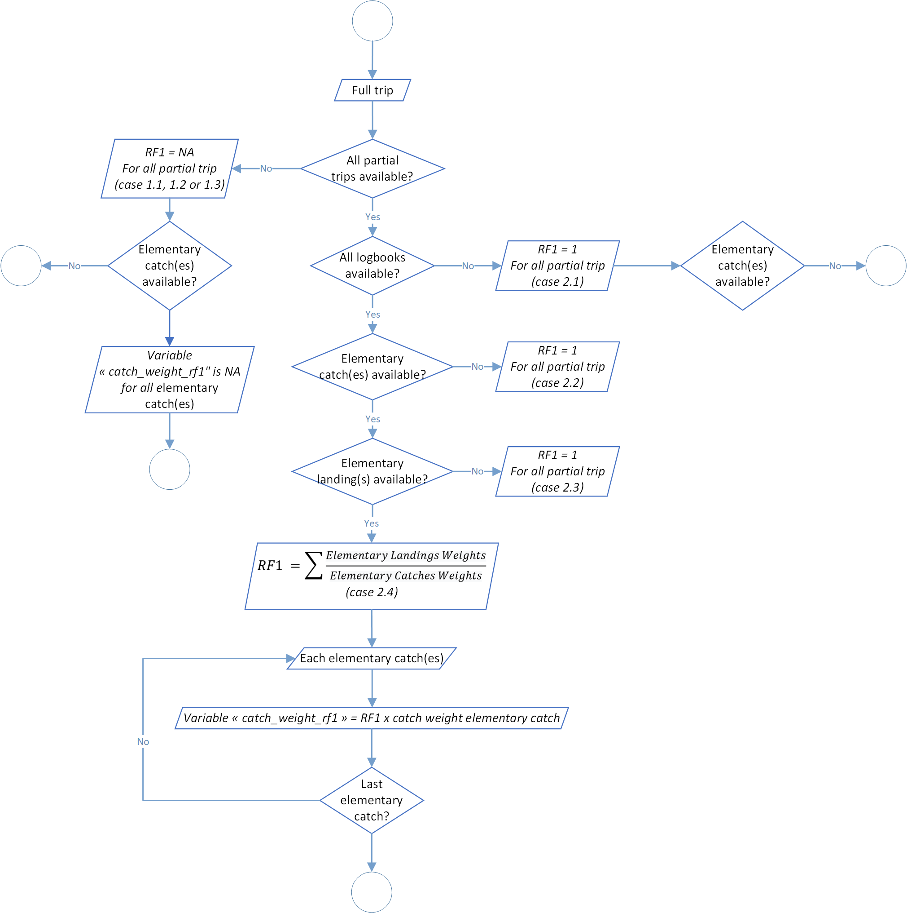
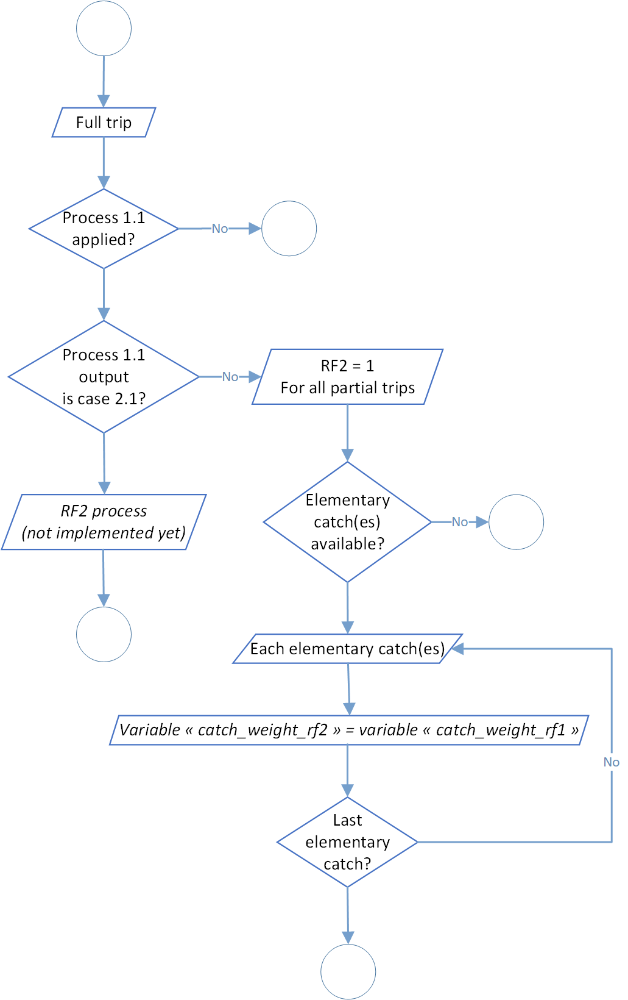

```{r, include = FALSE}
knitr::opts_chunk$set(
  collapse = TRUE,
  comment = "#>"
)
```

<div style="text-align: justify">

## Logbooks standardisation

The first level of the t3 process aim to standardize logbook data. These standardization was divided into 8 steps:

| Process                                           | Code/method associated         | Class(es) associated | Observations |
|---------------------------------------------------|--------------------------------|----------------------|--------------|
| Process 1.1: Raising Factor level 1               | `rf1()`                        | full_trips           |              |
| Process 1.2: Raising Factor level 2               | `rf2()`                        | full_trips           |              |
| Process 1.3: logbook weigth categories conversion | `conversion_weigth_category()` | full_trips           |              |
| Process 1.4: postive sets count                   | `set_count()`                  | full_trips           |              |
| Process 1.5: set duration calculation             | `set_duration()`               | full_trips           | In hours     |
| Process 1.6: time at sea calculation              | `time_at_sea()`                | full_trips           | In hours     |
| Process 1.7: fishing time calculation             | `fishing_time()`               | full_trips           | In hours     |
| Process 1.8: searching time calculation           | `searching_time()`             | full_trips           | In hours     |

### Process 1.1: Raising Factor level 1

Catches filled in logbooks are based on visual estimations when they rise from the purse senner salabarde. This is the only technical way available at this moment to have an estimation by species. Thereafter, catches will be stored in one or several wells. During the landing process, well catches will be weighed, generally through a peson located under the unloading crane. By move from set to well(s) we lost the exact information about catch location.

Regarding this process, for each full trip we will calculate a Raising Factor (RF), ratio of landing weight on catch weight. To recall, one full trip should be composed of one or several partial trip, for example if a vessel unloads a part of these wells and go back to the sea with not empty well(s). Furthermore, a RF level 1 value is normally between 0.8 and 1.2. If any values were out of range, an investigation if necessary for data quality control. This range could be modified through function parameters `rf1_lowest_limit` (by default at 0.8) and `rf1_highest_limit` (by default at 1.2). In addition, you will find in the function log a warning for each RF level 1 value out of range. This ratio will be applied to logbook catches to adjust declared values (by rising or lower them).

Be careful, so far in the process all RF level 1 values will be applied to the logbook catches associated, even if values are out of range. It's up to the user to check the log file and correct data, if necessary, before moving to the next process.

Furthermore, not all the well species are weighted during the landing process. Only several tunas species are purchased (and weighted by association). In addition, these species should be different for each fleet, especially because canneries don't purchased through the same rules according to the fleet. This raising factor will be estimated only on theses species. Species list could be modified through the function parameter `species_rf1`. For now theses following selections were validated since several years:

* for French (French and Mayotte fleets), use codes 1 (*Thunnus albacares*), 2 (*Katsuwonus pelamis*), 3 (*Thunnus obesus*), 4 (*Thunnus alalunga*), 9 (mix of tunas species) and 11 (*Thunnus tonggol*).

* for Spain (Spanish and Seychelles fleets), use codes 1 (*Thunnus albacares*), 2 (*Katsuwonus pelamis*), 3 (*Thunnus obesus*), 4 (*Thunnus alalunga*), 5 (*Euthynnus alletteratus*), 6 (*Auxis thazard*),  9 (mix of tunas species) and 11 (*Thunnus tonggol*).

In addition, if logbook(s) are missing we can't apply the process. In that case, we will tried to apply the process of Raising Factor level 2 (see section below regarding the process `rf2()`).

By the way, there are several cases when the RF level 1 can't be calculated. Take a look to the diagram below to have a brief overview of the process. You could notify that the structure of the process should be strange in terms of informatics efficiency (for example with repetitions of some steps, not necessarily on the first look). This is perfectly normal because we think about the potential improvement of the process in the future and we let the field open for an easier implementation.



<div style="text-align: center">Figure 1: Raising Factor level 1 flowchart.</div>

### Process 1.2: Raising Factor level 2

In some cases, especially for historial data, several logbooks trips were not collected or available. Therefore it's impossible to apply the process 1.1. Don't do anything for this trips would result in an under-estimation of catches among the global process. Of course and like the process 1.1, we made the hypostesis that all the landings were know and available.

So far, this process is partially implemented in the source code and in our data simulation since 2000 we haven't been faced with trips with missing logbooks. Due to time constraints, the development of this process has been postponed, but it will be essential to finalise it when we run our process on the whole time serie (and when we manipulated historical data). The figure below show the actual development of the process. 



<div style="text-align: center">Figure 2: Raising Factor level 2 flowchart.</div>

### Process 1.3: logbook weigth categories conversion

The core of the t3 process is to consider that the species composition of the logbooks was biased. Furthermore, logbook information related to global weight catches and weight categories are correct. Indeed, the weight categories of individuals as a strong influence on their commercial value. Furthermore, these weight categories change from one tuna fishing company to another, involves overlaps and are hardly usable directly from the logbook.

This process aims to homogenise these weight categories and create simplify categories divided in function of the fishing school and the ocean:

- < 10kg and > 10kg for the floating object school in the Atlantic and Indian Ocean,
- < 10kg, 10-30kg and > 10kg for undetermined and free school in the Atlantic Ocean,
- < 10kg and > 10kg for undetermined and free school in the Indian Ocean.

For eatch layer ocean/fishing school/specie/logbook weigth categorie, a distribution key is applied for conversion to standardised weight categories. Details of the distribution key is available in tables below.

| Specie         | Logbook weight category | Weight ratio | Standarised logbook weigth category |
|----------------|-------------------------|--------------|-------------------------------------|
| YFT, BET & ALB | 1                       | 1            | < 10kg                              |
| YFT, BET & ALB | 2                       | 1            | < 10kg                              |
| YFT, BET & ALB | 3                       | 1            | 10-30kg                             |
| YFT, BET & ALB | 4                       | 0,2          | < 10kg                              |
| YFT, BET & ALB | 4                       | 0,8          | 10-30kg                             |
| YFT, BET & ALB | 5                       | 1            | > 30kg                              |
| YFT, BET & ALB | 6                       | 0,5          | 10-30kg                             |
| YFT, BET & ALB | 6                       | 0,5          | > 30kg                              |
| YFT, BET & ALB | 7                       | 1            | > 30kg                              |
| YFT, BET & ALB | 8                       | 1            | > 30kg                              |
| YFT, BET & ALB | 10                      | 1            | < 10kg                              |
| YFT, BET & ALB | 11                      | 0,1          | 10-30kg                             |
| YFT, BET & ALB | 11                      | 0,9          | > 30kg                              |
| YFT, BET & ALB | 12                      | 1            | 10-30kg                             |
| YFT, BET & ALB | 13                      | 1            | > 30kg                              |
| SKJ            | All                     | 1            | < 10kg                              |
| Others         | All                     | 1            | Unknown                             |

<div style="text-align: center">Table 1: Distribution conversion key for undetermined and free school in the Atlantic Ocean.</div>

| Specie         | Logbook weight category | Weight ratio | Standarised logbook weigth category |
|----------------|-------------------------|--------------|-------------------------------------|
| YFT, BET & ALB | 1                       | 1            | < 10kg                              |
| YFT, BET & ALB | 2                       | 1            | < 10kg                              |
| YFT, BET & ALB | 3                       | 1            | > 10kg                              |
| YFT, BET & ALB | 4                       | 0,2          | < 10kg                              |
| YFT, BET & ALB | 4                       | 0,8          | > 10kg                              |
| YFT, BET & ALB | 5                       | 1            | > 10kg                              |
| YFT, BET & ALB | 6                       | 1            | > 10kg                              |
| YFT, BET & ALB | 7                       | 1            | > 10kg                              |
| YFT, BET & ALB | 8                       | 1            | > 10kg                              |
| YFT, BET & ALB | 10                      | 1            | < 10kg                              |
| YFT, BET & ALB | 11                      | 1            | > 10kg                              |
| YFT, BET & ALB | 12                      | 1            | > 10kg                              |
| YFT, BET & ALB | 13                      | 1            | > 10kg                              |
| SKJ            | All                     | 1            | < 10kg                              |
| Others         | All                     | 1            | Unknown                             |

<div style="text-align: center">Table 2: Distribution conversion key for floating object school in the Atlantic Ocean and for undetermined, free and floating object school in the Indian Ocean.</div>

Among the process, there are two major step:

- the first one for conversion of all categories except for unknown category (9),
- the second one for conversion of category unknown if it's possible.

During the first part, all logbook weight categories except the category unknow are standardised following the distribution conversion key display above. Each catch weight associated is multiply by the weight ratio associated. For several logbook weight category, like the categories 4 or 11 according to strata, this standardisation create new data because the initial logbook weight category is divied into several standardised logbook weight categories. It's normal that at the end of the process you could have more catch items than before.

For the second part, the process try to make the conversion of catches filled in the unknown category. For each trip and at the scale of an ocean/fishing school/specie, proportion of standardised logbook weight categories will be applied on items filled as unknown logbook weight categories. For example, in a common stratum, if proportion weight of standardised logbook weight category are divided by 60% for the category < 10kg and 40% for the category > 10kg, catches weight of unknown logbook weight category will display in standardised logbook weight category with 60% of < 10kg category and 40% of > 10kg category. 

The global process flowchart is available in the figure 3 below.


<div style="text-align: center">Figure 3: Logbook weigth categories conversion flowchart.</div>
 
### Process 1.4: postive sets count

In this process, for each activity filled as null set (0), positive set (1), unknown set (2) or pocket capsizing (14) in the data, a count of set is done according to the catches associated. Like before, the global process flowchart is available below in figure 4.


<div style="text-align: center">Figure 4: Postive sets count flowchart.</div>

### Process 1.5: set duration calculation

The aim of this process is to calculate the duration of each set in hours. Like the process before, for each activity filled as null set (0), positive set (1), unknown set (2) or pocket capsizing (14), the set duration is calculated according to a linear function:    

$ \text{set duration value} = a * \sum_{1}^{n} \text{catch weight category corrected} + b $

Parameters values of a and b are found through a reference table, for each year, ocean, fishing school and country. Furthermore, a specific value provided for a null set (a fishing set without any catches associated). An example of this reference table is available below in the table 3.

| Year | Country    | Ocean | Fishing school  | a       | b     | Null set value |
|------|------------|-------|-----------------|---------|-------|----------------|
| 2014 | Seychelles | 2     | 1               | 0,33235 | 127,1 | 120            |
| 2014 | Seychelles | 2     | 2               | 0,33235 | 127,1 | 120            |
| 2014 | Seychelles | 2     | 3               | 0,33235 | 127,1 | 120            |
| 2015 | Seychelles | 2     | 1               | 0,33235 | 127,1 | 120            |
| 2015 | Seychelles | 2     | 2               | 0,33235 | 127,1 | 120            |
| 2015 | Seychelles | 2     | 3               | 0,33235 | 127,1 | 120            |
| 2016 | Seychelles | 2     | 1               | 0,33235 | 127,1 | 120            |
| 2016 | Seychelles | 2     | 2               | 0,33235 | 127,1 | 120            |
| 2016 | Seychelles | 2     | 3               | 0,33235 | 127,1 | 120            |
| 2017 | Seychelles | 2     | 1               | 0,33235 | 127,1 | 120            |
| 2017 | Seychelles | 2     | 2               | 0,33235 | 127,1 | 120            |
| 2017 | Seychelles | 2     | 3               | 0,33235 | 127,1 | 120            |
| 2018 | Seychelles | 2     | 1               | 0,33235 | 127,1 | 120            |
| 2018 | Seychelles | 2     | 2               | 0,33235 | 127,1 | 120            |
| 2018 | Seychelles | 2     | 3               | 0,33235 | 127,1 | 120            |
| 2019 | Seychelles | 2     | 1               | 0,33235 | 127,1 | 120            |
| 2019 | Seychelles | 2     | 2               | 0,33235 | 127,1 | 120            |
| 2019 | Seychelles | 2     | 3               | 0,33235 | 127,1 | 120            |
| 2020 | Seychelles | 2     | 1               | 0,33235 | 127,1 | 120            |
| 2020 | Seychelles | 2     | 2               | 0,33235 | 127,1 | 120            |
| 2020 | Seychelles | 2     | 3               | 0,33235 | 127,1 | 120            |
| 2021 | Seychelles | 2     | 1               | 0,33235 | 127,1 | 120            |
| 2021 | Seychelles | 2     | 2               | 0,33235 | 127,1 | 120            |
| 2021 | Seychelles | 2     | 3               | 0,33235 | 127,1 | 120            |

<div style="text-align: center">Table 3: Set duration reference parameters.</div>

In addition the global process flowchart is available in the figure 5 below.


<div style="text-align: center">Figure 5: Set duration calculation flowchart.</div>

### Process 1.6: time at sea estimation

This step aim to make an estimation, at the trip scale, of the time at sea in hours. For each trip we have several possibilities:

- first, if departure and landing dates have times associated and available. So time at sea value will the difference between these two values. Unfortunately, this case is not the major scenario that we have regarding our data available.
- secondly, if departure and landing dates haven't times available and no activity is associated with the trip. In this case, time at sea will be the difference between the departure date value plus one day and the landing date minus one day.
- finally, if departure and landing dates haven't times available but at least one activity is associated with the trip. Just like the previous one, time at sea will be the difference between the departure date value plus one day and the landing date minus one day but in addition to time at sea of each activity occur on the same dates as departure or landing dates.

The global process flowchart is available in the figure 6 below.


<div style="text-align: center">Figure 6: Time at sea estimation flowchart.</div>

### level 1.7: fishing time determination

This process calculated the fishing time value in hours. Historialcaly, this process use a constant parameter according to the theorical day duration working time (12 or 13 hours according to the ocean and related to the global sunrise and sunset). Now, the process was modified to bring more accuracy in the calculation and module the duration of a working day according to the real sunrise and sunset of each day.

These parameters could be modify in the parameters `sunrise_schema` and `sunset_schema` and use in background the R package [suncalc](https://CRAN.R-project.org/package=suncalc). The function associated use latitude and longitude data to provide sunrise and sunset times of the selected day. Furthermore, you can switch between several values for these two parameters to adjust the process:

- sunrise: sunrise (top edge of the sun appears on the horizon),
- sunriseEnd: sunrise ends (bottom edge of the sun touches the horizon),
- goldenHourEnd: morning golden hour ends(soft light, best time for photography),
- solarNoon: solar noon (sun is in the highest position),
- goldenHour: evening golden hour starts,
- sunsetStart: sunset starts (bottom edge of the sun touches the horizon),
- sunset: sunset (sun disappears below the horizon, evening civil twilight starts),
- dusk: dusk (evening nautical twilight starts),
- nauticalDusk: nautical dusk (evening astronomical twilight starts),
- night: night starts (dark enough for astronomical observations),
- nadir: nadir (darkest moment of the night, sun is in the lowest position),
- nightEnd: night ends (morning astronomical twilight starts),
- nauticalDawn: nautical dawn (morning nautical twilight starts),
- dawn: dawn (morning nautical twilight ends, morning civil twilight starts).

At the trip scale and related to all the activities related, the fishing time value is the sum of each fishing time day if in the day activites associated at least one is different of no-wake road (4), damage (7), on hold (10), at the harbour (15) or fictive activity for trip without logbook (100).

The global process flowchart is available in the figure 7 below.


<div style="text-align: center">Figure 7: Time at sea estimation flowchart.</div>

### level 1.8: searching time process


        
</div>
