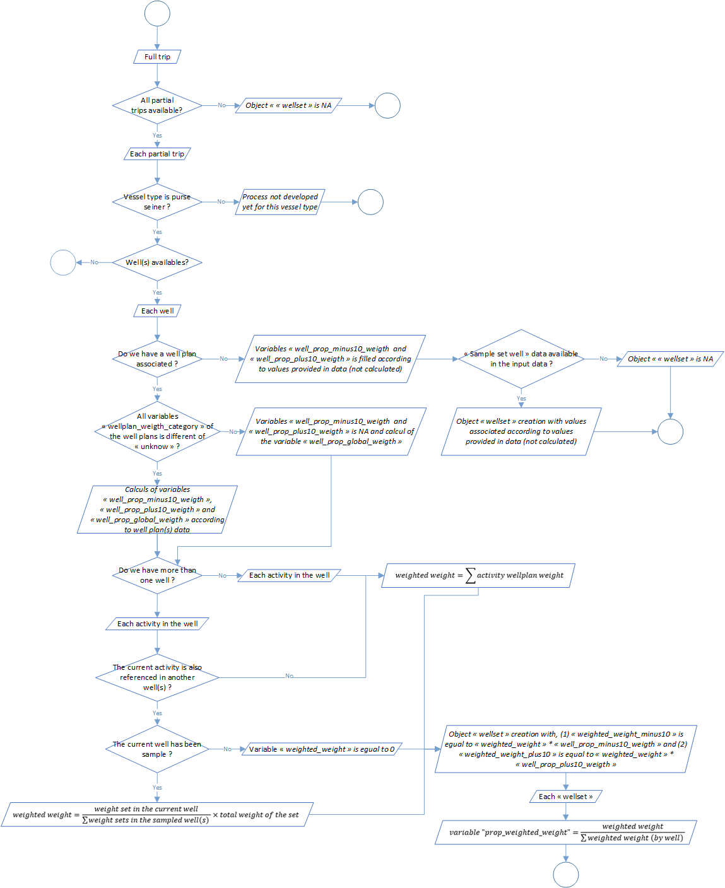
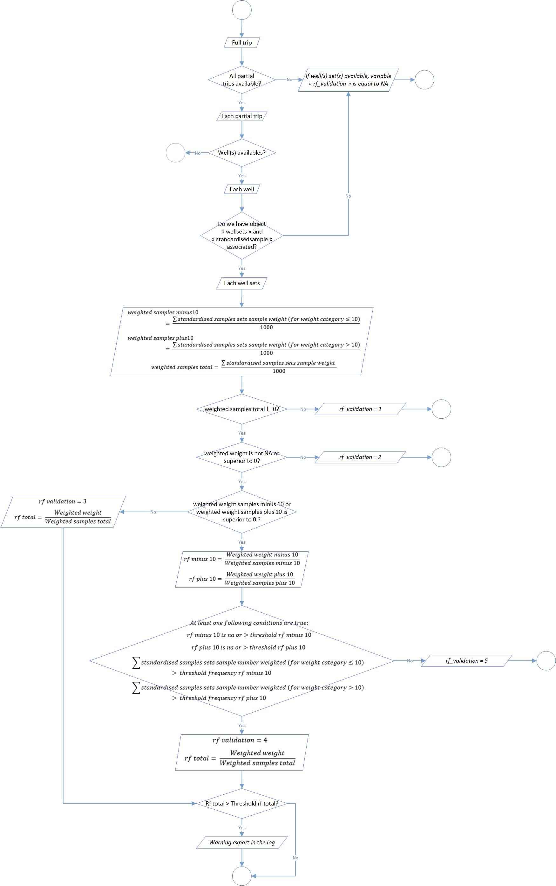

```{r, include = FALSE}
knitr::opts_chunk$set(
  collapse = TRUE,
  comment = "#>"
)
```

<div style="text-align: justify">

## Samples standardisation

The second level of the t3 process aim to standardize samples data. These standardization was divided into 8 steps:

| Process                                                  | Code/method associated                       | Class(es) associated  |   |   |
|----------------------------------------------------------|----------------------------------------------|-----------------------|---|---|
| Process 2.1: sample length class ld1 to lf conversion    | `sample_length_class_ld1_to_lf()`            | full_trips            |   |   |
| Process 2.2: sample number measured extrapolation        | `sample_number_measured_extrapolation()`     | full_trips            |   |   |
| Process 2.3: sample step length class standardisation    | `sample_length_class_step_standardisation()` | full_trips            |   |   |
| Process 2.4: well set weight categories                  | `well_set_weigth_categories()`               | full_trips            |   |   |
| Process 2.5: standardised sample creation                | `standardised_sample_creation()`             | full_trips            |   |   |
| Process 2.6: sample number standardisation               | `standardised_sample_set_creation()`         | full_trips            |   |   |
| Process 2.7: raised factors determination                | `raised_factors_determination()`             | full_trips            |   |   |
| Process 2.8: samples number standardisation at set scale | `raised_standardised_sample_set()`           | full_trips            |   |   |

### Process 2.1: sample length class LD1 to LF conversion

During the sampling process, fishes length can be collected and expressed in different standards. For example, regarding field constraints and more precisely the length of the different species, sampling data covered in T3 can by express in first dorsal length (LD1) or curved fork length (LF). Generally, length of small individuals are provided in LF because it's logistically possible and easier to measure the entire fish, while length of bigger individuals are provided in LD1, for the same reciprocal reasons.

This step aim to standardise this standard among sampling data and at the end have only lenght sampling data expressed in LF. Historrical and so far, the process use a referential conversion table LD1 to LF. This table are expressed and used throught a stratification by ocean and specie. You can find an example of a part of it in the table 1 below.

| Ocean    | Specie | LD1 length class | LF length class | Distribution ratio |
|----------|--------|------------------|-----------------|--------------------|
| Atlantic | YFT    | 38,0             | 132             | 4                  |
| Atlantic | YFT    | 38,0             | 134             | 7                  |
| Atlantic | YFT    | 38,0             | 136             | 16                 |
| Atlantic | YFT    | 38,0             | 138             | 23                 |
| Atlantic | YFT    | 38,0             | 140             | 23                 |
| Atlantic | YFT    | 38,0             | 142             | 16                 |
| Atlantic | YFT    | 38,0             | 144             | 7                  |
| Atlantic | YFT    | 38,0             | 146             | 4                  |

<div style="text-align: center">Table 1: Conversion LD1 to LF referential table for the YFT (*Thunnus albacares*) in the Atlantic Ocean.</div>

Like you can see in the table 1, for one LD1 length class we have several LF length classes. That mean that in our data processed the number of sampling item could rise. Furthermore, tunas regional fisheries management organisations, like International Commission for the Conservation of Atlantic Tunas (ICCAT) or the Indian Ocean Tuna Commission (IOTC), have validated conversion factors for types of size measurements. One of our next update will be to modify the process according theses formula.

The global process flowchart is available in the figure 1 below.


<div style="text-align: center">Figure 1: Sample length class LD1 to LF conversion flowchart.</div>

### Process 2.2: sample number measured extrapolation


### Process 2.3: sample step length class standardisation


### Process 2.4: well set weight categories



### Process 2.5: standardised sample creation


### Process 2.6: sample number standardisation


### Process 2.7: raised factors determination



### Process 2.8: samples number standardisation at set scale


