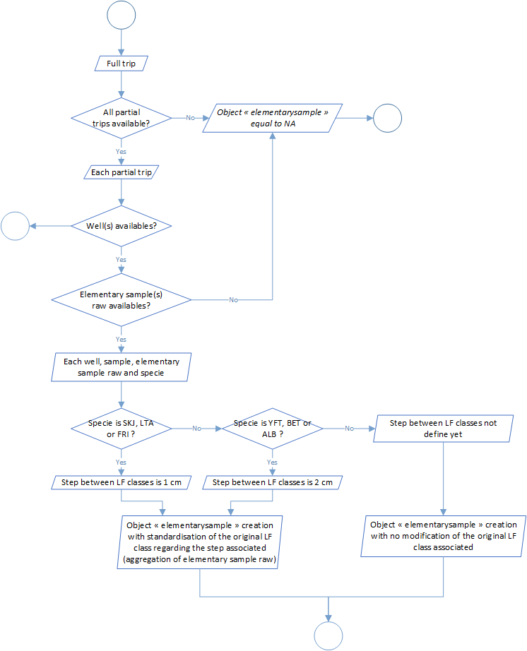

```{r, include = FALSE}
knitr::opts_chunk$set(
  collapse = TRUE,
  comment = "#>"
)
```

<div style="text-align: justify">

## Samples standardisation

The second level of the t3 process aim to standardize samples data. These standardization was divided into 8 steps:

| Process                                                  | Code/method associated                       | Class(es) associated  |   |   |
|----------------------------------------------------------|----------------------------------------------|-----------------------|---|---|
| Process 2.1: sample length class ld1 to lf conversion    | `sample_length_class_ld1_to_lf()`            | full_trips            |   |   |
| Process 2.2: sample number measured extrapolation        | `sample_number_measured_extrapolation()`     | full_trips            |   |   |
| Process 2.3: sample step length class standardisation    | `sample_length_class_step_standardisation()` | full_trips            |   |   |
| Process 2.4: well set weight categories                  | `well_set_weigth_categories()`               | full_trips            |   |   |
| Process 2.5: standardised sample creation                | `standardised_sample_creation()`             | full_trips            |   |   |
| Process 2.6: sample number standardisation               | `standardised_sample_set_creation()`         | full_trips            |   |   |
| Process 2.7: raised factors determination                | `raised_factors_determination()`             | full_trips            |   |   |
| Process 2.8: samples number standardisation at set scale | `raised_standardised_sample_set()`           | full_trips            |   |   |

### Process 2.1: sample length class ld1 to lf conversion


### Process 2.2: sample number measured extrapolation


### Process 2.3: sample step length class standardisation



### Process 2.4: well set weight categories


### Process 2.5: standardised sample creation


### Process 2.6: sample number standardisation


### Process 2.7: raised factors determination


### Process 2.8: samples number standardisation at set scale


