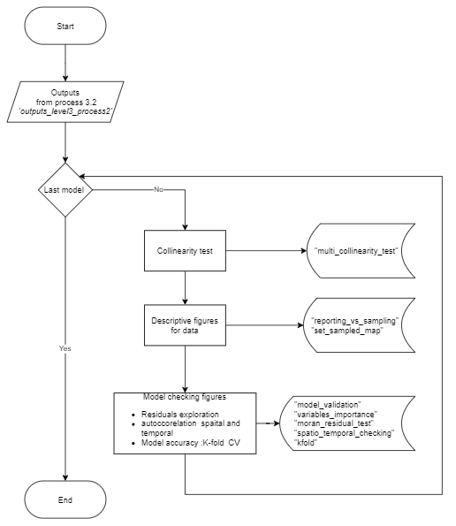

```{r, include = FALSE}
knitr::opts_chunk$set(
  collapse = TRUE,
  comment = "#>"
)
```

<div style="text-align: justify">

## Modelling species proportion in catch and Computation of catch estimates

The level 3 process of the T3R package aim at modelling species composition before estimating catch for the major tuna species only: Yellowfin tuna, skipjack and bigeye tuna. The process is divided in 5 steps:

|  **Process**  | **Name**                   |  **Corresponding method**          |
|---------------|----------------------------|------------------------------------|
| 3.1           | Data preparatory           | `data_preparatory()`               |
| 3.2           | Modelling                  | `random_forest_models() `          |
| 3.3           | Data and model diagnostic  | `models_checking()`                |
| 3.4           | Dataset for prediction     | `data_formatting_for_predictions()`|
| 3.5           | Catch prediction           | `model_predictions()`              |

### Process 3.1: Data preparatory


### Process 3.2: Modelling


### Process 3.3: Data and Model checking



### Process 3.4: Dataset for prediction


### Process 3.5: Modelling species composition and estimating catch


